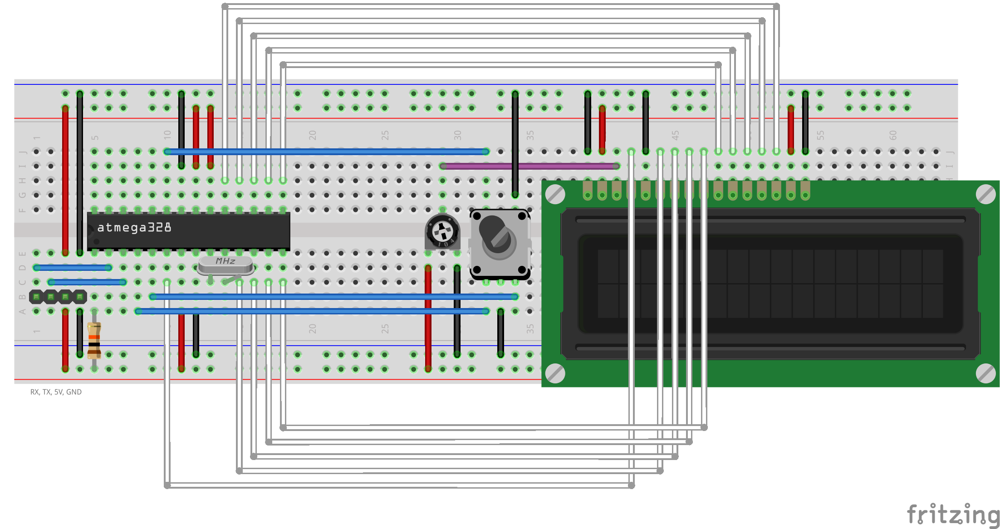
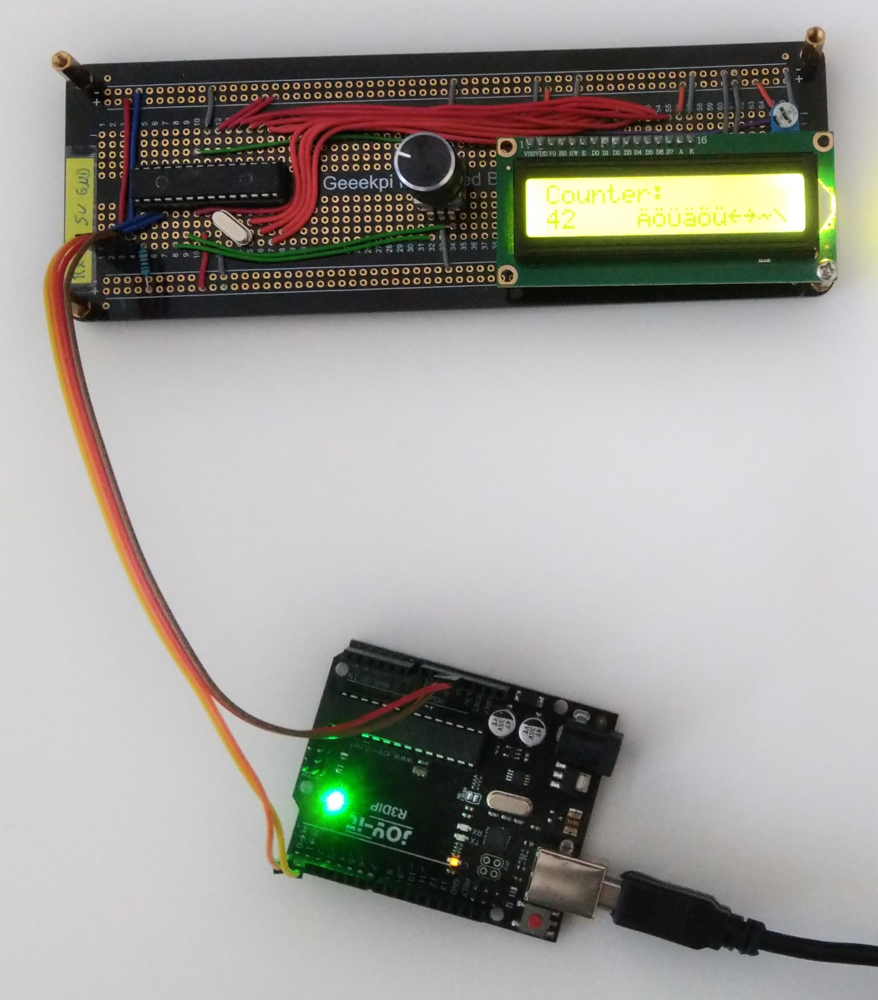
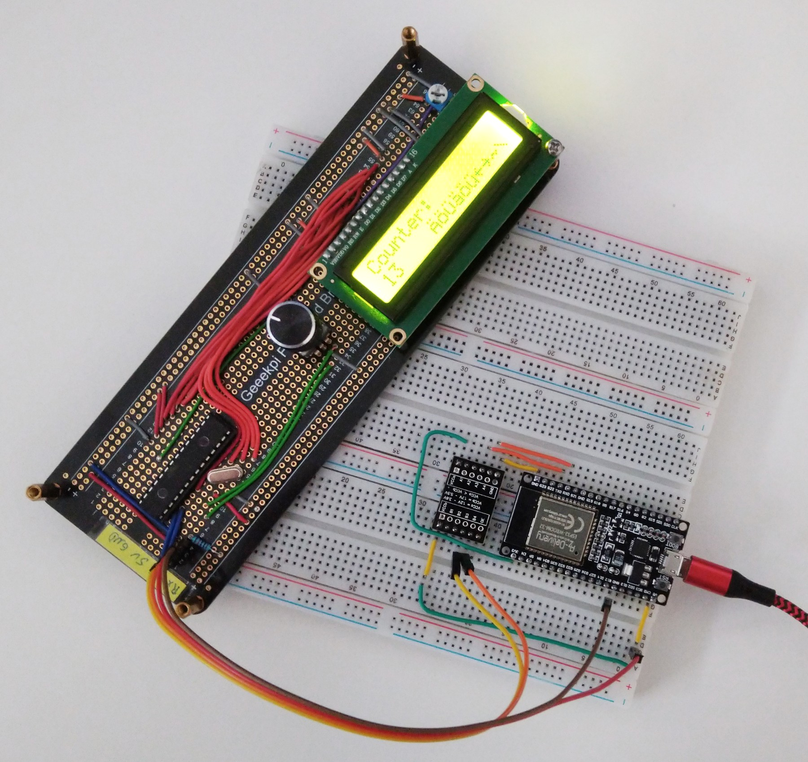
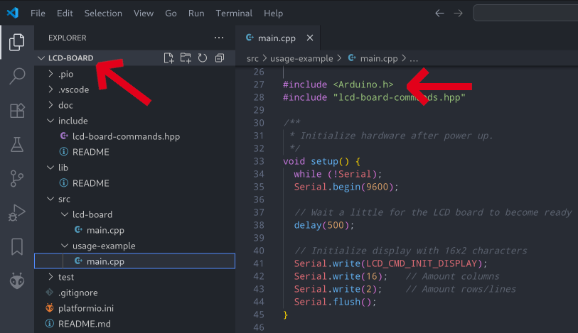
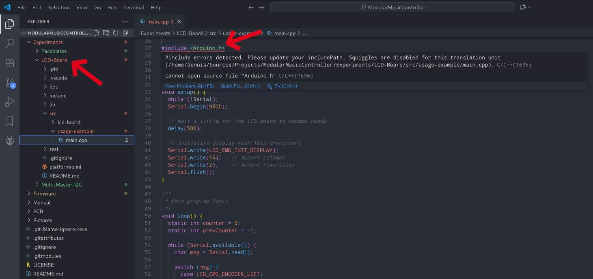

Experiment: Generic LCD-Board with multiple MCUs
================================================

1. [Description](#description)
1. [Learning Targets](#learning-targets)
1. [Schematics and Pictures](#schematics-and-pictures)
1. [PlatformIO Learnings](#platformio-learnings)
1. [Rotary Encoder Learnings](#rotary-encoder-learnings)
1. [Other Learnings](#other-learnings)

Description
-----------

Use [PlatformIO](platformio.org) to develop a small generic board with an LCD, a rotary encoder
and a button that can serve as a simple UI for remote microcontroller attached via UART. Use the
Arduino libraries for prototyping and also the Arduino Uno to program the Atmega328p MCU. Use the
same project to build an additional sample project that shows how to use the new board. Build the
sample for different platform architectures (here Arduino UNO and ESP32).

Learning Targets
----------------

1. Install the PlatformIO IDE extension in VS Code
1. Structure a project with multiple target platforms
1. Build distinct firmware programs for each target
1. Build the same code for different architectures, where needed
1. Share code between the firmware programs
1. Include external libraries
1. Working with Arduino and ESP32 boards

Schematics and Pictures
-----------------------

<table>
    <tr>
        <td>
            
        </td>
        <td>
            
        </td>
    </tr>
    <tr>
        <td>TODO: LCD-Board schematics</td>
        <td>Breadboard layout</td>
    </tr>
    <tr>
        <td>
            
        </td>
        <td>
            
        </td>
    </tr>
    <tr>
        <td>Test with Arduino Uno</td>
        <td>Test with ESP32</td>
    </tr>
</table>


For quick testing it can be built with on a breadboard. But be aware that the connections are
very unreliable. Thus for the final prototype I decided to do a permanent build on a breadboard
PCB (a PCB with the same connection scheme than a normal breadboard), as can be seen in the
photographs at the end.

To program the Atmega328p we use a simple trick. We simply upload the image to a stock Arduino Uno
(the version with the socket mounted DIP-version of the Atmega328) and then remove the IC from the
Arduino board. To restore the Arduino Uno's function we simply drop in a replacement Atmega328p
with the Arduino bootloader (which is easy to burn yourself).

PlatformIO Learnings
--------------------

1. Content of the `platform.io` configuration file (environments, platforms, library dependencies)
1. Basic usage of the `pio` CLI and the IDE UI
1. [How to use the `pio` command shipped with the PlatformIO extension](#pio-command-not-found)
1. [How to use mono repos with VS Code and PlatformIO IDE](#platformio-ide-and-mono-repos)
1. [How to build different firmwares for different targets](#how-to-build-different-firmwares-for-different-targets)
1. [Sharing header files](#sharing-header-files)
1. [Flashing Arduino and ESP32 boards](#working-with-arduino-and-esp32-boards)

### `pio` command not found

Normally the PlatformIO IDE extension has a setting that says "Use Builtin PIO Core" that should add an
included version of the `pio` command to the terminal path. If you find like me, that this is not working,
simply extend your `$PATH` in your `.bashrc` or similar file.

```sh
export PATH=$PATH:~/.platformio/penv/bin
```

This is actually much easier than all the [solutions in the documentation](https://docs.platformio.org/en/latest/core/installation/shell-commands.html#piocore-install-shell-commands).

### PlatformIO IDE and mono repos

Like so often with VS Code, the IDE and its extension assume a single repo, where each code repository
(actually workspace) hosts exactly one project. That is, the PlatformIO IDE extension **and** VS Code
assume that the `platformio.ini` file lies at the root of your workspace / repository. If like me you
like to bundle all that belongs to a "project" (meaning a project in real-life, not the technical term
used by the IDE that is nothing more than a plain source directory) in a mono-repo, you can do that.

But you must always open only the sub-directory with the sub-project that you are currently working on.
Never open the whole repository as a workspace in VS Code. Because then the PlatfromIO IDE extension won't
find the `platformio.ini` file, as it only looks for it in the root directory of the workspace. Thus it
never generates the `.vscode/*.json` files that VS Code also expects to find at the workspace root. The
result will be that you cannot use the IDE functions to build projects and that VS Code reports a lot of
errors due to seemingly missing header files.

If it looks like the left image, all is fine: If it looks like the right image, you are in trouble.
You need to close the workspace and reopen only the directory with the PlatformIO project that you are
working on.

<table>
    <tr>
        <td>
            
        </td>
        <td>
            
        </td>
    </tr>
    <tr>
        <td>Good: Sub directory is workspace</td>
        <td>Bad: Repository root is workspace</td>
    </tr>
</table>

### How to build different firmwares for different targets

By default PlatformIO assumes that you want to build the exact same source for each environment defined
in `platformio.ini`. This is meant to define separate build configurations like `release` or `debug`.
Actually, see the [Build Configurations](https://docs.platformio.org/en/latest/projectconf/build_configurations.html)
in the documentation on how to do this.

Another use case can be to actually build different programs for some of the environments. A typical use
case would be to have multiple boards with distinct hardware and responsibility, like in this project.
In that case, create sub-directories for each program below `src` and use [`build_src_filter`](https://docs.platformio.org/en/latest/projectconf/sections/env/options/build/build_src_filter.html)
to define which environment build which program. e.g. like this:

```ini
[env:lcd-board]
; Platform, Board, Framework, ...
build_src_filter = 
    +<lcd-board>

[env:usage-example-arduino-uno]
; Platform, Board, Framework, ...
build_src_filter =
    +<usage-example>

[env:usage-example-esp32]
extends = env:usage-example-arduino-uno
; Different Platform, Board, Framework, ...
```

### Sharing header files

The default PlatformIO directory layout has the following directories:

* `include`: Shared header files
* `lib`: Shared libraries, not externally installed
* `src`: Source code for the actual firmware to build

If all you need is to share some header files between different firmwares (defined using `build_src_filter`
in `platformio.ini`) simply place them in the `include` directory. If you put them into `lib` you need to
place them in a separate sub-directory and add this is a library dependency (`lib_deps`) in the INI file.

### Working with Arduino and ESP32 boards

Useful commands:

* `pio device list`: Enumerate attached boards
* `pio device monitor`: Attach serial terminal to board
* `pio run -e usage-uno`: Run default targets (by default only build)
* `pio run -e usage-uno --t upload`: Upload a previously built image
* `pio run --list-targets`: See what else you can do (depends on the platform and board)

**NOTE:** By setting `targets = upload, monitor` the the PlatformIO environment we can simply call
`pio run` to build, upload and monitor a program.

```text
$ pio run --list-targets
Environment    Group     Name         Title                        Description
-------------  --------  -----------  ---------------------------  ----------------------
lcd-board      Platform  bootloader   Burn Bootloader
lcd-board      Platform  fuses        Set Fuses
lcd-board      Platform  size         Program Size                 Calculate program size
lcd-board      Platform  upload       Upload
lcd-board      Platform  uploadeep    Upload EEPROM

usage-uno      Platform  bootloader   Burn Bootloader
usage-uno      Platform  fuses        Set Fuses
usage-uno      Platform  size         Program Size                 Calculate program size
usage-uno      Platform  upload       Upload
usage-uno      Platform  uploadeep    Upload EEPROM

usage-esp32    Platform  buildfs      Build Filesystem Image
usage-esp32    Platform  erase        Erase Flash
usage-esp32    Platform  size         Program Size                 Calculate program size
usage-esp32    Platform  upload       Upload
usage-esp32    Platform  uploadfs     Upload Filesystem Image
usage-esp32    Platform  uploadfsota  Upload Filesystem Image OTA
```

Rotary Encoder Learnings
------------------------

1. [When to use?](#when-to-use-rotary-encoders)
1. [Difference between detent count vs. edge count](#detent-count-vs-edge-count)
1. [Deboucning strategies for rotary encoders](#debouncing-strategies)
1. [Connection many rotary encoders](#connecting-many-many-rotary-encoders)

### When to use rotary encoders

Trying out the example gives the impression that mechanical rotary encoders as UI elements
are best used for relative changes to a value, where

* Quantization is not a problem, because the edited value is quantized by nature
* Precise editing is required, allowing the user to step +1 / -1
* A full rotation has no inherent meaning (it is just a relative change in value)

Good candidates would be menu cursors, stepped values etc.

Not so good a candidate would be a filter cut-off due to the stepping and you would expect
a full sweep with roughly a 300° rotation.

### Detent count vs. edge count (encoding resolution)

Rotary encoders are quadrature encoders. This means, for higher precision, they generate
four valid state transitions for each detent. For speed measuring (with an optical encoder)
this is nice. But the detent is what the user percieves as a single step. So we need to
sub-sample and only read every 4th transition, unless we want the sub-step precission to
smooth the in-between values.

Given the signals A and B of the encoder, these are the valid transitions:

* Clock-wise: 00 → 01 → 11 → 10 → 00
* Counter clock-wise: 00 → 10 → 11 → 01 → 00

A can be interpreted as a clock signal and B as the direction. When A raises, B indicates
the direction. This was the first version of the code. It is called "non-quadrature mode"
in the LS7366R datasheet and is implemented exactly like this in the IC (no filtering,
instantaneous triggering). Who would have known in advance? 🙂

```c++
constexpr int encoder_a_pin = 2;
constexpr int encoder_b_pin = 3;
constexpr int button_pin    = A0;

void setup() {
  pinMode(encoder_a_pin, INPUT_PULLUP);
  pinMode(encoder_b_pin, INPUT_PULLUP);

  attachInterrupt(digitalPinToInterrupt(encoder_a_pin), rotaryEncoderISR, RISING);
}

void rotaryEncoderISR() {
  if (digitalRead(encoder_b_pin) == HIGH) {
    // Clock-wise rotation
  } else {
    // Counter clock-wise rotation
  }
}
```

This is simple but due to bouncing only works for medium rotation speeds. With higher speed
it will miss a lot detents and even ocassionaly register the wrong direction. Fixing this
in hardware would require debouncing the signals. But in practice we can do it in sofware
using a small state-machine pattern:

```c++
constexpr int encoder_a_pin = 2;
constexpr int encoder_b_pin = 3;
constexpr int button_pin    = A0

volatile uint8_t rotEnc = 0;;

void setup() {
  pinMode(encoder_a_pin, INPUT_PULLUP);
  pinMode(encoder_b_pin, INPUT_PULLUP);

  attachInterrupt(digitalPinToInterrupt(encoder_a_pin), rotaryEncoderISR, CHANGE);
  attachInterrupt(digitalPinToInterrupt(encoder_b_pin), rotaryEncoderISR, CHANGE);
}

void rotaryEncoderISR() {
  if (
    (rotEnc == 0b00 && state == 0b01) ||
    (rotEnc == 0b01 && state == 0b11) ||
    (rotEnc == 0b11 && state == 0b10) ||
    (rotEnc == 0b10 && state == 0b00)
  ) {
    rotEnc = state;

    if (state == 0b00) {
        // Clock-wise rotation
    }
  } else if (
    (rotEnc == 0b00 && state == 0b10) ||
    (rotEnc == 0b10 && state == 0b11) ||
    (rotEnc == 0b11 && state == 0b01) ||
    (rotEnc == 0b01 && state == 0b00)
  ) {
    rotEnc = state;

    if (state == 0b00) {
      // Counter clock-wise rotation
    }
  }
}
```

This correctly handles the valid transitions while ignoring all invalid transitions due to bouncing.
`if (state == 0b00)` applies the sub-sampling to only register the rotation for each "detent".
As said, for higher precission we could read each edge and use this to calculate in-between values,
if the movement is more important than the final value.

### Debouncing strategies

The above state-machine is a simple solution to debounce rotary encoders in software. But it has
some severe drawbacks:

* It is entirely in software using CPU cycles.
* The CPU is interrupted very often especially when many encoders are connected.
* Vibrations and bouncing can cause a lot of signal changes, too hogging the CPU.
* This specific implementation requires up to four edges to resynchronize in case of error.
* Each encoder is directly connected using two GPIOs.

This works okay for probably like four encoders but will not scale much beyond. The following other
options exist:

1. Use a MCU with rotary encoder timers (e.g. STM32, but the amount is limited like two to four)
2. Sample the encoders at a fixed interval, e.g. every 1ms (roughly the same interval as hardware debouncing)
3. Debounce in hardware using a RC filter + Schmitt trigger (e.g. 10kΩ + 100nF to ground into 74HC14)
4. Use a dedicated IC like LS7366R (SPI) or the older HCTL-2022 / HCTL-2032 (parallel interface)

For more details than you ever wanted to know (in German) see [mikrocontroller.net](https://www.mikrocontroller.net/articles/Drehgeber).

The default solution, when no dedicated hardware is available, seems to be option 2. Sample at least
every millisecond (if it is a relatively slow encoder). The sample interval must be chosen in accordance
to the maximum frequency of the encoder so that every state change is reliabley sampled at least once.

### Connecting many many rotary encoders

Using a dedicated IC like the LS7366R seems like a good idea to reduce pin-count and query more
encoders than there are GPIOs available. Except, it isn't. The IC is rather expensive and very hard
to get from the usual electronics distributors. If pin-count is a problem, we might consider the
following options:

* Implement the same functionality with a tiny MCE like the ATtiny85 (or similar)
* Cascade several shift registers (parallel-in, serial-out), e.g. 74HC165
* Use I²C/SPI port extenders, e.g. PCF8575 or better MCP23017 (DIP package available, I²C and SPI)

Shift registers are cheap (ca. 0,3 €), port extends a bit more expensive (ca. 1,90 € for 16-bit).
But the shift registers are harder to get DIP packages. Still, shift registers should work fairly
well for this use case even when bit-banged every millisecond.

Other Learnings
---------------

1. [Arduino's `Serial` on ESP32](#arduinos-serial-on-esp32)
1. [Serial Communication Speed](#serial-communication-speed)
1. [Updating the LCD](#updating-the-lcd)

### Arduino's `Serial` on ESP32

It basically works the same as on the Arduino Uno. However, there are a few differences to be aware of:

1. The default speed is 115200 on the ESP32 and 9600 on the Arduino Uno.
1. The ESP32 sends boot messages on UART0 which might confuse other attached reveivers.
1. The Arduino library for ESP32 defines additional `Serial1` and `Serial2` objects for the other UARTs.
1. The Arduino library only allows to change the default pins for `Serial1` and `Serial2`.

### Serial Communication Speed

9600 Baud for the serial communication between the LCD board and the MCU works better than 115200.
Both work, but with 115200 I observed quite some delays between screen updates. Will talk to Agent
Mulder for a new X file. 👽

### Updating the LCD

Clearing the LCD before printing new text produces a quick noticeable flicker. In the real product
we must be careful enough to only update the parts that have actually changed and not to clear the
LCD every time in between.